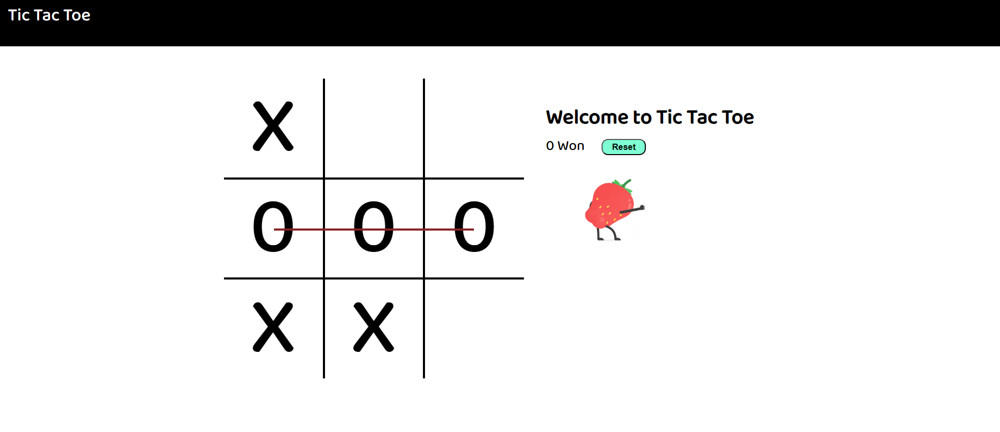

# Tic Tac Toe Game

This is a classic Tic Tac Toe game that you can play in your web browser. It's a two-player game where the objective is to be the first to form a horizontal, vertical, or diagonal line of your symbol (either "X" or "O") on the 3x3 game board.

## Features

- **Responsive Design**: The game is designed to work seamlessly on various screen sizes, including desktop and mobile devices.
- **Two-Player Mode**: Play against a friend locally, taking turns to place your symbol on the board.
- **Clear User Interface**: The game offers a clean and intuitive user interface.
- **Win Detection**: The game detects and announces the winner when a player forms a winning combination.
- **Draw Detection**: It also detects and announces a draw when the board is full with no winner.
- **Game Restart**: After a game concludes, you can easily restart and play again.

## How to Play

1. Open the [Tic Tac Toe Game](https://pandeydhruv2001.github.io/Tic-Tac-Toe/) in your web browser.
2. Choose a player to start (either "X" or "O").
3. Click or tap on an empty cell to place your symbol.
4. Alternate turns with your opponent.
5. The game announces the winner when one player forms a winning combination.
6. If no winner is found and the board is full, the game declares a draw.
7. Click the "Restart" button to start a new game.

## Demo

You can play the live Tic Tac Toe game [here](https://pandeydhruv2001.github.io/Tic-Tac-Toe/).

## Installation

To run the Tic Tac Toe game locally, you don't need to install anything. Simply visit the game's [GitHub repository](https://github.com/pandeydhruv2001/Tic-Tac-Toe) to access the source code.

## Technologies Used

- HTML5
- CSS3
- JavaScript

## Credits

The Tic Tac Toe game logic and design were inspired by various online sources and were created by [Dhruv Pandey](https://github.com/pandeydhruv2001). The project is open-source and available on GitHub for reference and contribution.

## License

This project is open-source and available under the [MIT License](https://github.com/pandeydhruv2001/Tic-Tac-Toe/blob/main/LICENSE).

## Contact

For any inquiries or suggestions, please feel free to contact the developer via GitHub.

Enjoy playing Tic Tac Toe with your friends!
